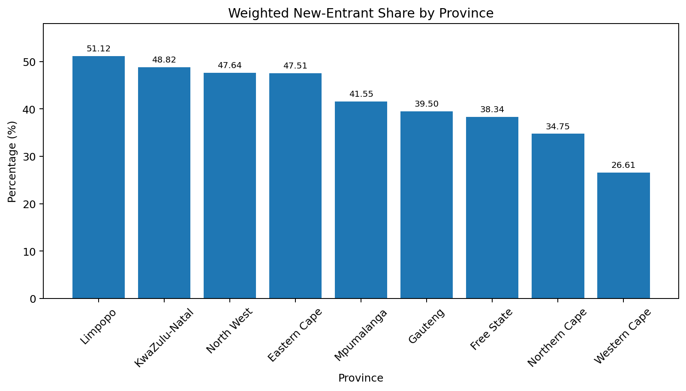
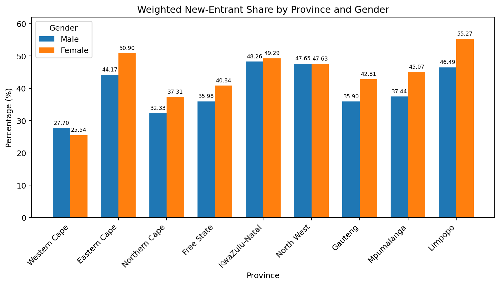
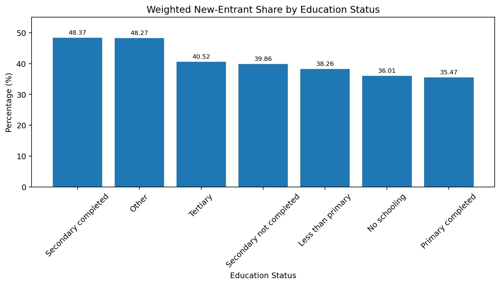

# South Africa Labour Market Analysis — QLFS 2026 Q1

## Project Overview

This project analyses South Africa's **Quarterly Labour Force Survey (QLFS) 2026 Q1** unit-record data, with a focus on **new entrants to unemployment**.

The project demonstrates an end-to-end data analysis workflow using Python: understanding the dataset, validating variables, cleaning special values, exploring the data, applying survey weights, visualising results, and communicating findings in a final report.

## Research Questions

1. How does the weighted new-entrant share vary across South African provinces?
2. How does the weighted new-entrant share differ between males and females across provinces?
3. How does the weighted new-entrant share vary across education statuses?

## Dataset

The analysis uses the **Statistics South Africa Quarterly Labour Force Survey (QLFS), 2026 Q1**.

The original dataset contains approximately **62,819 observations and 200 variables**.

The raw QLFS microdata is **not included in this repository**. To reproduce the analysis, obtain the QLFS 2026 Q1 unit-record data from Statistics South Africa and place the CSV file in:

```text
data/QLFS202601.csv
```

The notebook expects that location when run from the `notebooks/` directory.

## Tools & Technologies

- Python
- pandas
- NumPy
- Matplotlib
- Jupyter Notebook

## Data Cleaning and Validation

Important preparation steps included:

- inspecting dataset dimensions, data types, and variables;
- distinguishing analytical variable types from pandas storage types;
- identifying special large numeric values used for missing/not-applicable responses;
- converting those values to `NaN` where appropriate;
- validating age and categorical codes against QLFS metadata;
- excluding constant variables that did not contribute to the analysis;
- retaining legitimate extreme values rather than removing them without evidence; and
- restricting the main new-entrant calculations to respondents with a valid unemployment status.

## Methodology

The project follows the workflow:

**Understand → Validate → Clean → Explore → Analyse → Visualise → Report**

Survey weights are used for the main findings.

For the new-entrant analysis, the denominator consists of respondents with a **valid unemployment status**. The reported percentages therefore represent the weighted share of this group classified as new entrants.

They should **not** be interpreted as provincial or demographic unemployment rates.

## Key Findings

### 1. Provincial differences

Among respondents with a valid unemployment status, **Limpopo had a weighted new-entrant share of 51.12%**, compared with **26.61% in the Western Cape**.

This represents a difference of **24.51 percentage points**.



### 2. Gender differences across provinces

The size and direction of the male-female difference varied across provinces.

In **Limpopo**, the weighted new-entrant share was:

- Female: **55.27%**
- Male: **46.49%**

This is a female-minus-male difference of **8.78 percentage points**.



### 3. Education status

The weighted new-entrant share also varied across education groups.

- Secondary completed: **48.37%**
- Primary completed: **35.47%**

The difference between these groups was **12.90 percentage points**.



## Repository Structure

```text
QLFS-2026-Data-Analysis/
├── README.md
├── data/
│   └── README.md
├── notebooks/
│   └── QLFS_2026_Analysis_Portfolio.ipynb
├── report/
│   └── QLFS_2026_Q1_New_Entrants_Report.pdf
├── visuals/
│   ├── province.png
│   ├── province_gender.png
│   └── education.png
└── requirements.txt
```

## View the Analysis

The full Python workflow is available in:

**`notebooks/QLFS_2026_Analysis_Portfolio.ipynb`**

The final written report is available in:

**`report/QLFS_2026_Q1_New_Entrants_Report.pdf`**

## How to Reproduce the Analysis

1. Clone or download this repository.
2. Obtain the QLFS 2026 Q1 unit-record CSV from Statistics South Africa.
3. Place it at `data/QLFS202601.csv`.
4. Install the required Python packages using `requirements.txt`.
5. Open `notebooks/QLFS_2026_Analysis_Portfolio.ipynb`.
6. Run the notebook cells in order.

## Limitations

- The analysis is descriptive and does not establish causal relationships.
- Survey weighting affects estimates and should be considered when comparing groups.
- Some QLFS variables contain not-applicable responses represented by special values that require careful treatment.
- Results apply to the QLFS 2026 Q1 data and should not automatically be generalised to other quarters.
- New-entrant shares in this project describe the composition of respondents with valid unemployment status, not the unemployment rate for the general population.

## Skills Demonstrated

This project demonstrates practical experience with:

- data cleaning and validation;
- pandas data manipulation;
- missing-value handling;
- categorical-variable interpretation;
- groupby and aggregation;
- survey-weighted calculations;
- demographic and geographic analysis;
- data visualisation with Matplotlib;
- analytical interpretation;
- reproducible project organisation; and
- communicating findings through a written analytical report.

## Project Outputs

- **Jupyter Notebook:** complete analysis workflow and Python code
- **PDF Report:** polished summary of methodology, findings, limitations, and conclusions
- **Visualisations:** key charts used to communicate the results

---

*Portfolio project based on Statistics South Africa's Quarterly Labour Force Survey (QLFS) 2026 Q1.*
